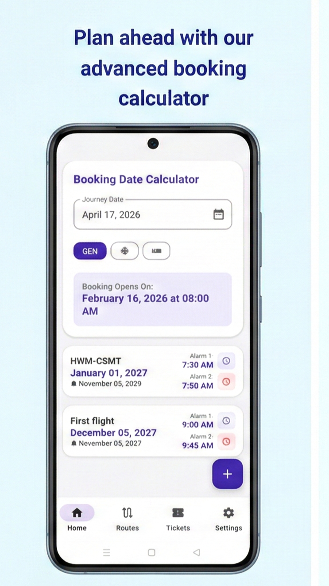
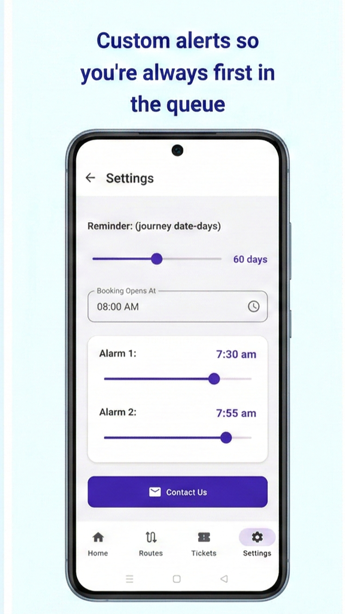
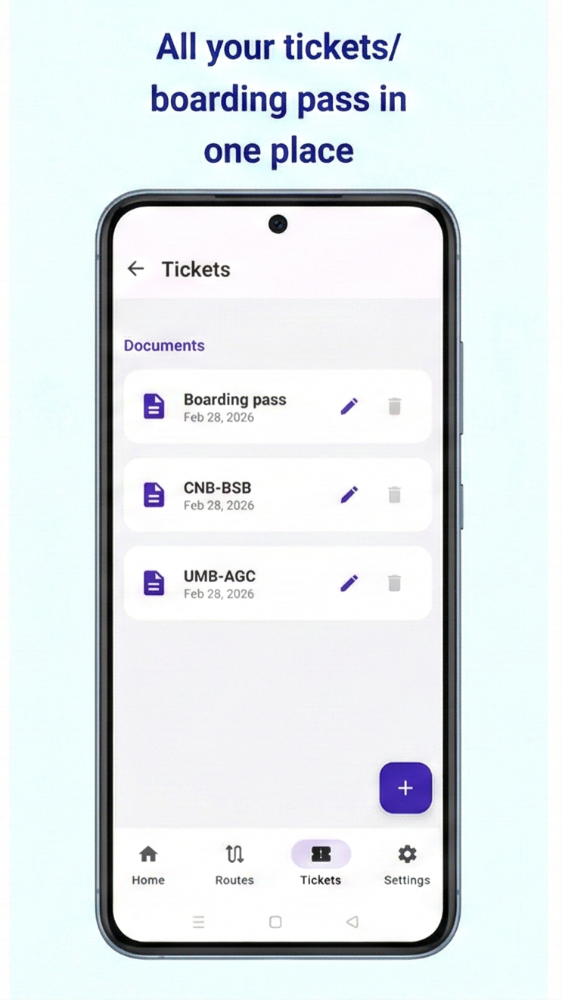
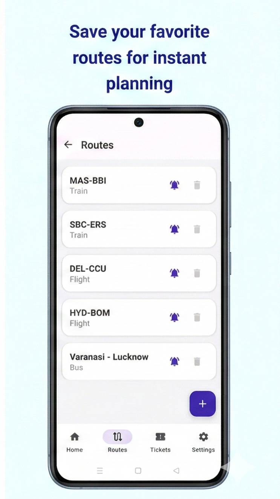

# Ticket Booking Reminder 🚂

**Never miss an IRCTC booking window again.**

Ticket Booking Reminder is a lightweight, privacy-focused utility designed for Indian Railway passengers. It takes the guesswork out of travel planning by calculating precise booking dates and setting automated alerts for the 60-day and Tatkal windows.

---

## ✨ Key Features

* **Smart Calculator:** Input your journey date to instantly see when General and Tatkal bookings open.
* **Precision Alarms:** Set dual reminders to ensure you are logged into IRCTC before the clock strikes 8:00 AM or 10:00 AM.
* **Ticket Vault:** Securely store your e-tickets and boarding passes locally on your device for quick access at the station.
* **Route Manager:** Save your frequent travel routes for one-tap calculations.
* **Privacy-First:** No ads, no tracking, and no data collection.

---

## 📱 Screenshots

| Home & Calculator | Settings & Alarms | Ticket Vault | Saved Routes |
| :---: | :---: | :---: | :---: |
|  |  |  |  |

---

## 🛡️ Privacy Policy

**Effective Date: March 4, 2026**

Ticket Booking Reminder is built as a Free app. This SERVICE is provided at no cost and is intended for use as is.

### Data Collection and Use
* **No Personal Data:** We do not collect, store, or share any personal information such as names, emails, or phone numbers.
* **Local Storage:** All journey dates, ticket files, and route information are stored locally on your device. This data is never transmitted to any external server.
* **Permissions:** The app may request notification permissions to provide booking alerts. It does not require location, contact, or camera access.

### Contact Us
If you have any questions or suggestions about our Privacy Policy, do not hesitate to contact us at **sruthyh.dev@gmail.com**.

---

## 🛠️ Built With
* **Kotlin & Jetpack Compose**
* **Material Design 3 (Railway Blue Theme)**
* **Local SQLite Storage**

* ## ⚖️ Disclaimer & Limitation of Liability
* **Non-Affiliation:** This app is NOT an official app of IRCTC or Indian Railways. We have no official relationship with these entities.
* **No Guarantee:** This app is a reminder tool only. We do not guarantee successful ticket bookings. The developer shall not be held liable for any missed bookings, financial losses, or travel delays resulting from the use or failure of this application.
* **Local Processing:** All data and reminders are processed locally on your device. We are not responsible for reminders failing due to device-specific battery optimizations or notification restrictions on systems.
